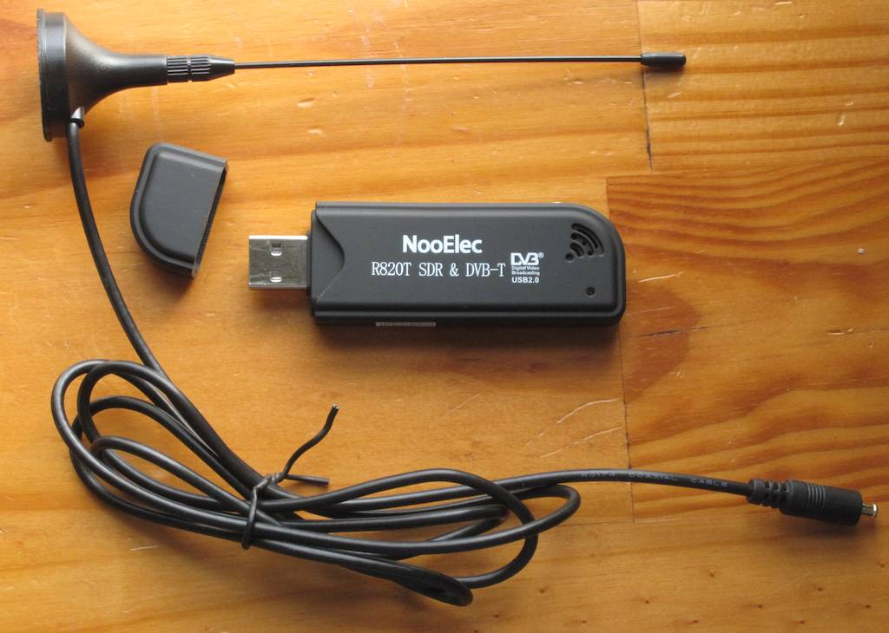
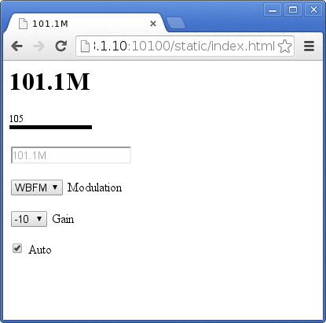

% Software Radio with CTypes
% T M Winningham
% July 27, 2014

# In this talk

- The USB Device & Software Radio
- The Python Library
- Development Process
- Demonstration

# Device -- What it is

</img>

> "RTL-SDR is a very cheap software defined radio that uses a DVB-T TV tuner dongle based on the RTL2832U chipset." 

rtl-sdr.com

radiohobbyist.org

# Device -- Definitions

Software Defined Radio
:    Digital sampling or synthesis of electromagnetic radation using software 
     at a specific center frequency and again 90° out of phase, allowing for 
     variable modes and bandwith

Digital Video Broadcasting -- Terrestrial (DVB-T)
:    European Standard for broadcast digital terrestrial television

# Device -- SDR Capability Discovery

- Antti Palosaari, Eric Fry, and Osmocom
- LinuxTV IRC and mailing list
- Internet community
- Realtek
- ~ $20

# Device -- Uses 

- Radio Reception, Spectrum Analysis
- Broadcast Analog FM Radio & RDS
- Police, Ambulance, Fire, EMS, Taxis
- Aircraft Communication & ADS-B Data
- Amateur Radio, Ambient Signals, Passive Radar
- GPS, NOAA Satellites, & much more...

# Device -- Limitations

- Receive Only
- Low dynamic range
- Unstable clock
- Noise
- Quality control issues
- Loss of free time

# Device -- Software -- GQRX

</img>

# Device -- Software -- librtlsdr 

Command line tools

rtl_sdr, rtl_test, rtl_tcp
:    Raw data, device testing, network sharing

rtl_fm, rtl_power, rtl_adsb
:    Audio or digital signals, spectrum scanning, aircraft tracking

# Device -- Find out more

- Reddit /r/rtlsdr
- Osmocom
- rtl-sdr.com
- NooElec 
- Adafruit
- YouTube 

# RTL_FM_PYTHON -- What it is

</img>

- Rapid prototype
- Based on rtl_fm.c
- CTypes
- Flask, React
- High level extensibility
- Stop gap

# RTL_FM_PYTHON -- Python Precedents

</img>

- GNU Radio Companion
- python-librtlsdr
- pyrtlsdr
- rtlsdr-waterfall
- ShinySDR

# Process -- Niche

- No GNU Radio requirement
- Lightweight
- Remote control
- Unix paradigm, composable like rtl_fm
- Signal demodulation

# Process -- Target Program

RTL_FM

- Command line utility
- Flexible uses
    - Audio
    - Digital signals 

# Process -- Target Program Example

    rtl_fm -M wbfm -f 101.1M - |aplay -r 32000 -f S16_LE -t raw -c 1 

- wide band FM demodulation
- 101.1 WOSU Classical 101
- Pipe to stdout
- Play at 32khz, 16-bit, mono

# Process -- Reading rtl_fm.c 

- Straightforward reading
- C is (usually, generally) simpler than C++
- Small blocks, descriptive function names
- Seemed doable

# Process -- Reading rtl_fm.c

    void usb_demod(struct demod_state *fm)
    {
        int i, pcm;
        int16_t *lp = fm->lowpassed;
        int16_t *r  = fm->result;
        for (i = 0; i < fm->lp_len; i += 2) {
            pcm = lp[i] + lp[i+1];
            r[i/2] = (int16_t)pcm * fm->output_scale;
        }
        fm->result_len = fm->lp_len/2;
    }

# Process -- Re-arranging

    some_type some_function (some_type some_parameter) {
       do_a_bunch_of_stuff(some_parameter);
       do_more_stuff();
       do_stuff_i_dont_understand();
       finish_up();
    }

to:

    some_type some_new_function(){
       do_more_stuff();
    }

# Process -- Compilation

    gcc -I /usr/include/libusb-1.0 
        -I ./convenience/ 
        -I ./getopt 
        -shared 
        -Wl,-soname,rtl_fm_python 
        -o rtl_fm_python.so 
        -fPIC 
        rtl_fm_python.c 
        convenience/convenience.c getopt/getopt.c 
        -lrtlsdr

# Process -- Iteration

</img>

# Process -- Composing Simple Blocks

    uint32_t lib_get_frequency(){
        return controller.freqs[controller.freq_now];
    }

- Inspecting / setting strong C types
- Thread Safe? Who knows!
- Global scope
- Google

# Process -- Python CTypes

    fm  = ctypes.CDLL('./rtl_fm_python.so')
    get_s_level     = fm.lib_get_s_level
    get_frequency   = fm.lib_get_frequency
    set_demod_fm    = fm.lib_set_demod_fm
    set_demod_wbfm  = fm.lib_set_demod_wbfm
    set_demod_am    = fm.lib_set_demod_am
    set_demod_lsb   = fm.lib_set_demod_lsb
    set_demod_usb   = fm.lib_set_demod_usb
    set_demod_raw   = fm.lib_set_demod_raw
    set_frequency   = lambda f : fm.lib_set_frequency(ctypes.c_uint32(f))
    set_squelch     = lambda l : fm.lib_set_squelch_level(ctypes.c_int(l))
    get_demod       = lambda   : chr(fm.lib_get_demod_mode())
    str_to_freq     = fm.lib_frequency_convert

# Process -- Achievements

- Wraps rtl_fm
- Drop-in replacement
- Inspect the running state
- Change frequency, mode, gain
- REST interface, GUI
- Scripting

# Process -- Future

- Other RTL-SDR programs
- Scanning
- More examples of composing, audio streaming
- Other people's projects
- Indiegogo fundraising project

# Demo

